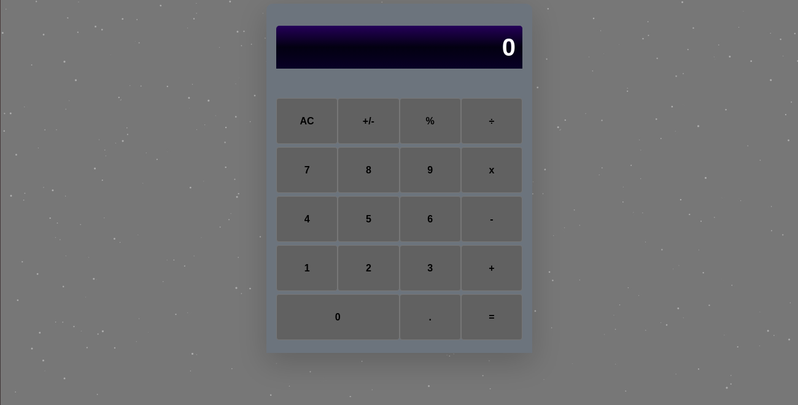

# React calculator

This is a basic calculator for performing simple mathematical calculation. This is practical implementation of react js completed as part of a series of projects to be completed by students of 
[Microverse](https://www.microverse.org/ "The Global School for Remote Software Developers!").


## Description

This applivation is built primarily with react.js framework. The application enables user to able to make basic mathematical operations as listed in the ```[Features]``` section below.

## Technologies

- React
- HTML
- CSS
- JSX
- Particle.js

## Features

- Addition
- Substration
- Multiplication
- Division
- Factorial
- Indices
- Logartithm
- Basic trigonometry

## Usage

> Clone the repository to your local machine

```sh
$ git clone https://github.com/forison/calculator.git
```
> cd into the directory

```sh
$ npm install
```

```sh
$ npm start
```

## Deployment

The demo page can be found [HERE](https://guarded-harbor-05894.herokuapp.com/)

## Designed and developed by

[Boakye Addo Forison](https://github.com/Forison)

## Contact

[LinkedIn](https://www.linkedin.com/in/forison/) | [Twitter](https://twitter.com/addo_forison)

## Appreciation

[Microverse](https://www.microverse.org/ "The Global School for Remote Software Developers!")

## Contributing

1. Fork it (https://github.com/Forison/calculator/)
2. Create your feature branch (git checkout -b feature/[choose-a-name])
3. Commit your changes (git commit -am 'What this commit will fix/add')
4. Push to the branch (git push origin feature/[chosen name])
5. Create a new Pull Request